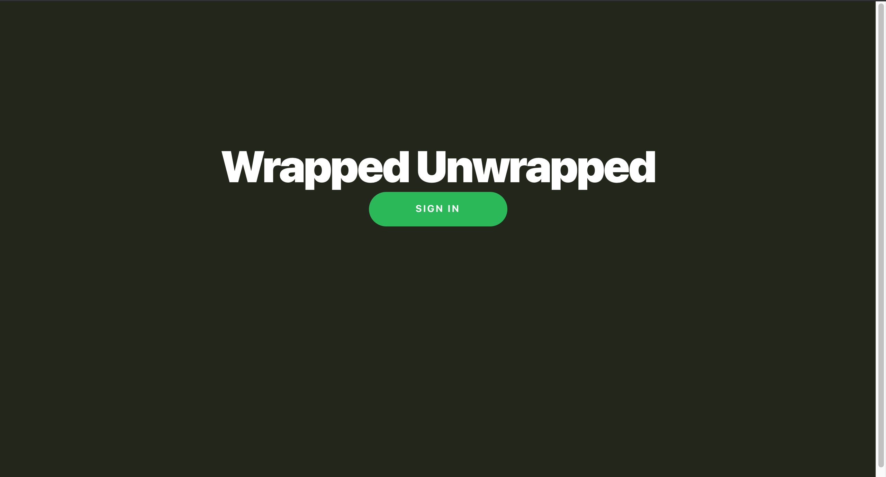
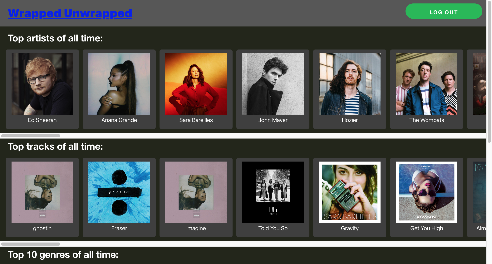
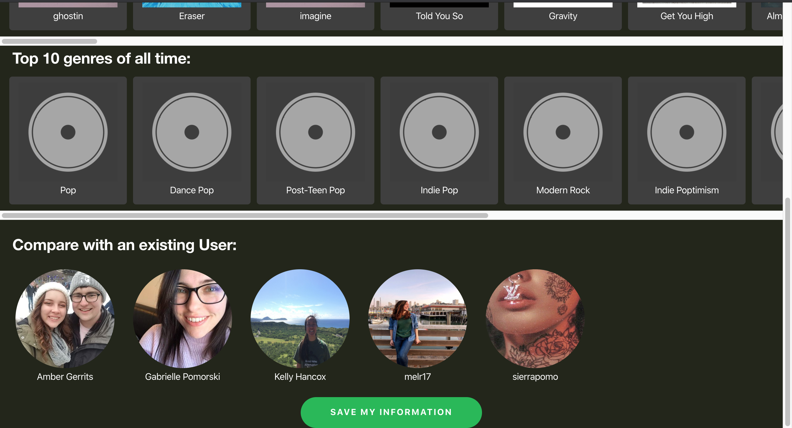
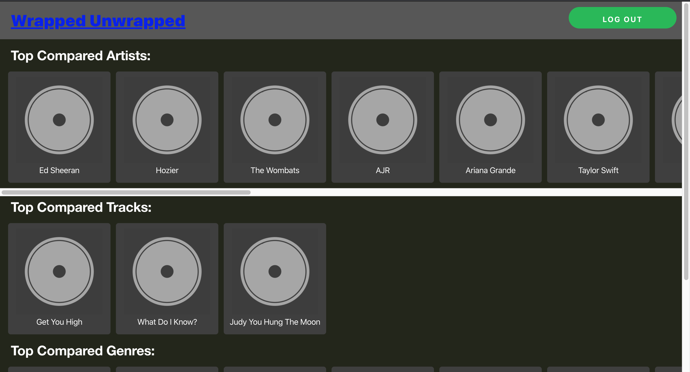

This project was bootstrapped with [Create React App](https://github.com/facebook/create-react-app).

## Available Scripts

In the project directory, you can run:

### `npm start`

Runs the app in the development mode. 
Open [http://localhost:3000](http://localhost:3000) to view it in the browser.

The page will reload if you make edits. 

# WrappedUnwrapped  

Don't wait for Spotify Wrapped. Get your top data now! This website uses the Spotify API to get your top Artists and Tracks of all time and lets you compare your tastes with other users.

This came about because I wanted to compare my own music tastes with my friends, specifically becuase I found the Spotify API last year and was absolutely fascinated with it.

____________________________________________________________________________________

When the user goes to _Wrapped Unwrapped_, they will see this page:  

This page redirects you to the Spotify login  

______________________________________________________________________________

### Results  

The user will be redirected back to their results  

Note, there isn't an API call to find the Genres. This is calculated manually by taking the genres of your top fifty artists, placing them in a hashmap, then sorting them and returning the top genres.

______________________________________________________________________________

### Comparing with other users  

When the user clicks on another user's image, they will be directed to the comparison page where they can view their likes and dislikes between themselves and other users.
